# EGC301P Operating Systems Lab Mini Project
# Academia Portal - Course Registration System

### Name: Sriram Srikanth
### Roll Number: IMT2023115

## Introduction
The Academia Portal is a comprehensive client-server application designed to streamline course registration and academic management in educational institutions. This system facilitates communication between administrators, faculty members, and students through a secure and efficient interface. Built with C programming and socket programming, the application ensures reliable data management with file-based storage and implements concurrent client handling. The system incorporates crucial OS concepts including process management, file locking mechanisms, semaphores, multithreading, and Inter-Process Communication to maintain data integrity during concurrent access.

## Tech Stack with Implementation
- **Programming Language**: C  
  The application is built entirely in C for its efficiency, low-level control, and performance benefits in system programming.
  
- **Socket Programming**:  
  Implements TCP/IP socket communication for reliable client-server interactions, allowing multiple clients to connect simultaneously.
  
- **File I/O and Locking**:  
  Utilizes file operations with read/write locks to manage concurrent access to critical data sections.
  
- **Multithreading**:  
  Employs POSIX threads (pthreads) to handle multiple client connections concurrently without blocking.
  
- **IPC Mechanisms**:  
  Implements Inter-Process Communication techniques to facilitate data exchange between server processes.
  
- **System Calls**:  
  Makes extensive use of Linux system calls for process management, file management, and synchronization.

## Source Code with Purpose of Each Module

```bash
Academia_CLI_Application/
├── bin/                   # contains all executed compiled files
├── classes/               # contains all helper function and structure files
│   ├── data/              # has all data files storing admin, student, faculty, course, enrollments data
│   ├── data_access.c      # file DB access functions
│   ├── data_access.h      
│   ├── server_helper.c    # server helper functions
│   ├── server_helper.h      
│   ├── structures.h       # has all object structures and request/response structs for socket communication
├── client.c               # client code
├── Makefile               # easily automate compile and running the client/server codes
├── server.c               # server code
├── README.md              # project documentation (You are here!)
```

- **server.c**:  
  The main server program that listens for incoming connections, authenticates users, and delegates client requests to appropriate handler functions.
  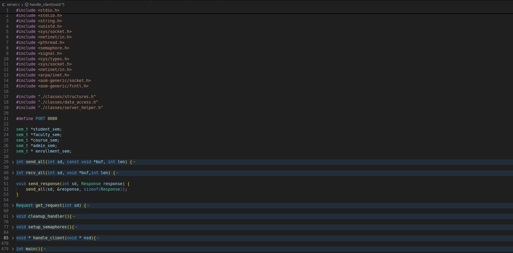
  
- **client.c**:  
  The client-side application that connects to the server, presents user interfaces based on role, and communicates user actions to the server.
  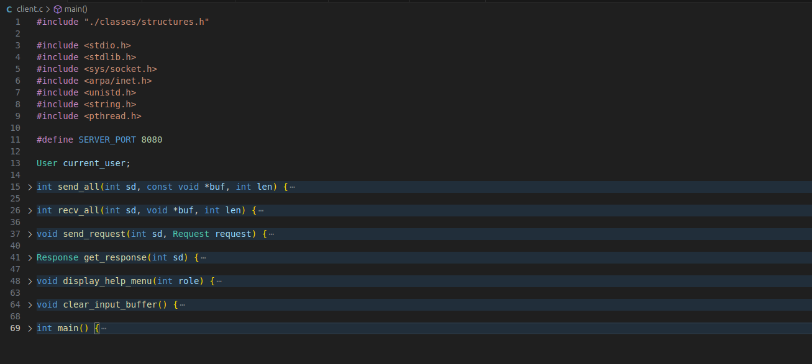
  
- **server_helper.c** and **server_helper.h**:  
  Helper functions for the server to process various requests like adding courses, managing enrollments, and handling user authentication.
  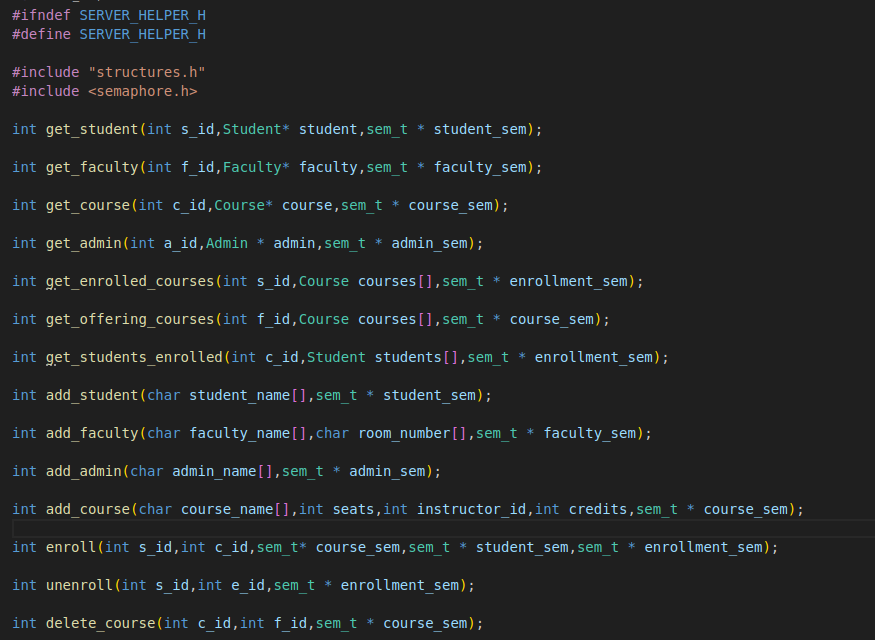

  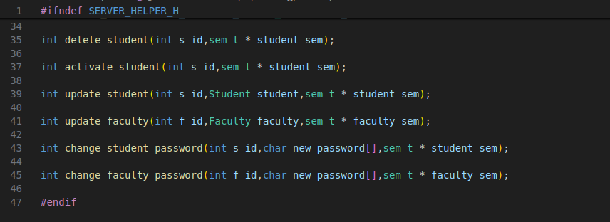
  
- **data_access.c** and **data_access.h**:  
  Database interaction layer that manages reading from and writing to data files with proper locking mechanisms.

  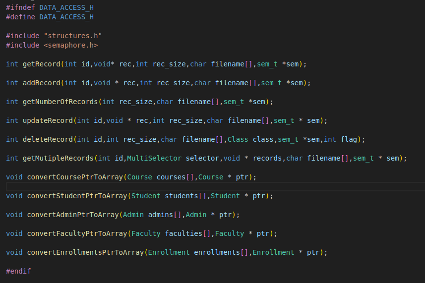
  
- **structures.h**:  
  Contains definitions of all data structures used throughout the application, including Student, Faculty, Admin, Course, and Enrollment records.

  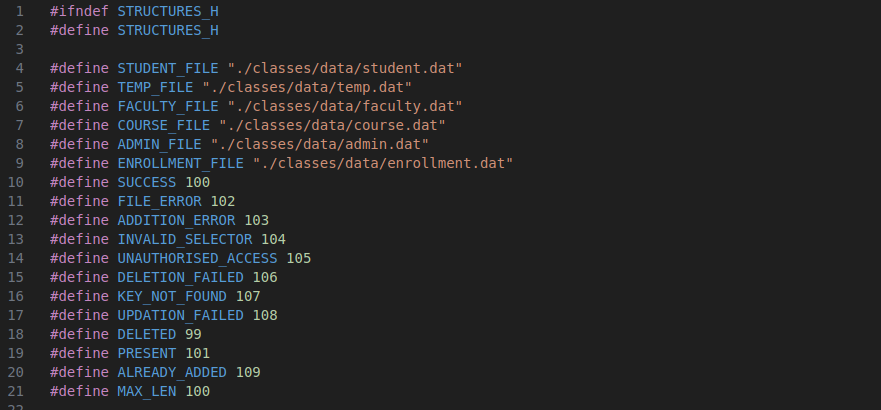

  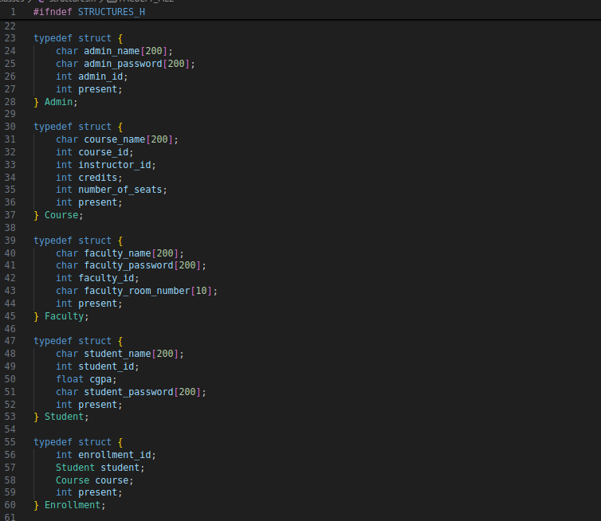

  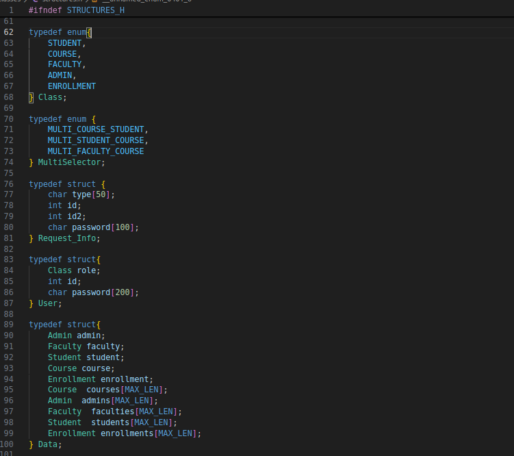

  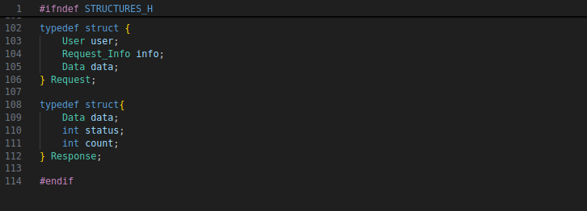

## Key Features
- **Role-Based Access Control**: Different interfaces and permissions for Administrators, Faculty members, and Students
- **Secure Authentication**: Password-protected login system for all users
- **Course Management**: Faculty can add, remove, and update course information
- **Enrollment System**: Students can enroll in or unenroll from courses with real-time seat availability tracking
- **Concurrent Access**: Multiple users can access the system simultaneously without data corruption
- **Data Persistence**: All information is stored securely in files with appropriate locking mechanisms

## Installation and Setup

Clone the repository
```bash
git clone https://github.com/Humanoid2005/Academia_CLI_Application.git
```

Navigate to the project directory
```bash
cd Academia_CLI_Application
```

Compile the application
```bash
make all
```

Start the server
```bash
make run-server
```

In a separate terminal, start a client
```bash
make run-client
```

## Usage

### Administrator Features
- Add and manage Students and Faculty accounts
- Activate or deactivate Student accounts
- Update Student/Faculty details

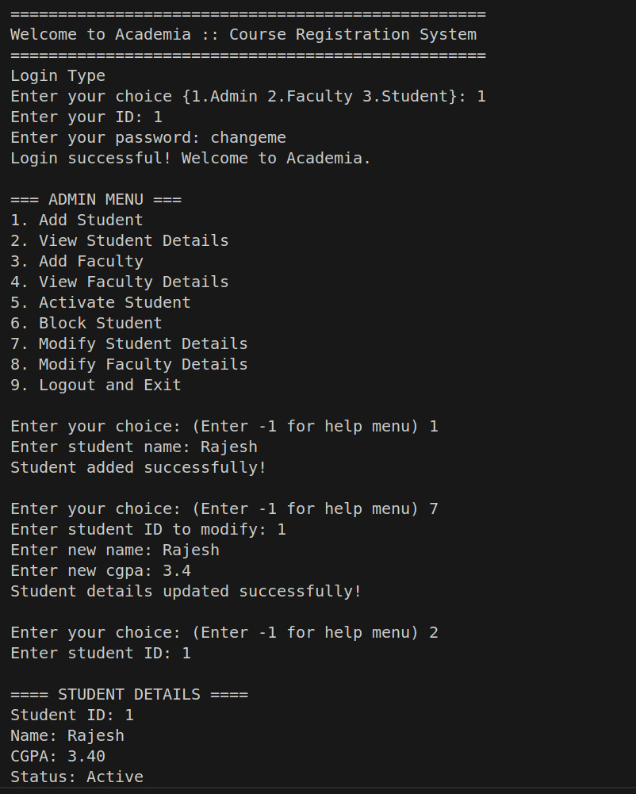

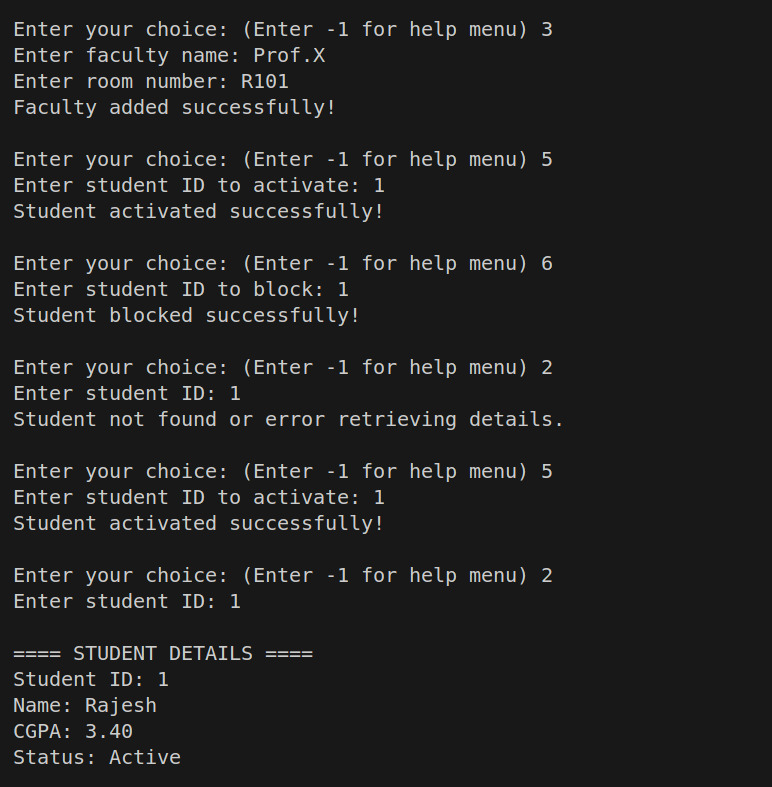

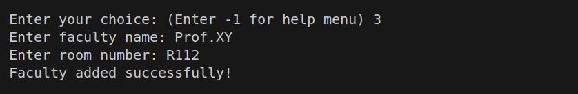

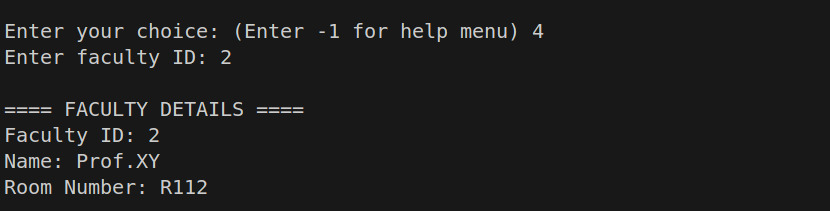

### Faculty Features
- Add new courses with seat limits
- Remove offered courses
- View student enrollments in courses
- Change password

  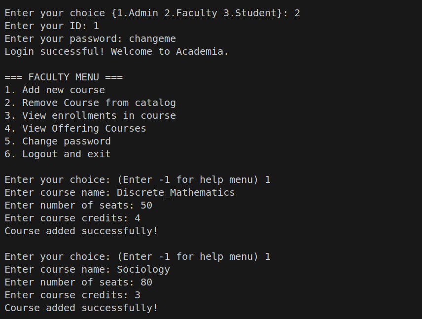

  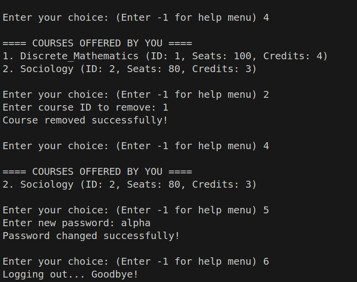

  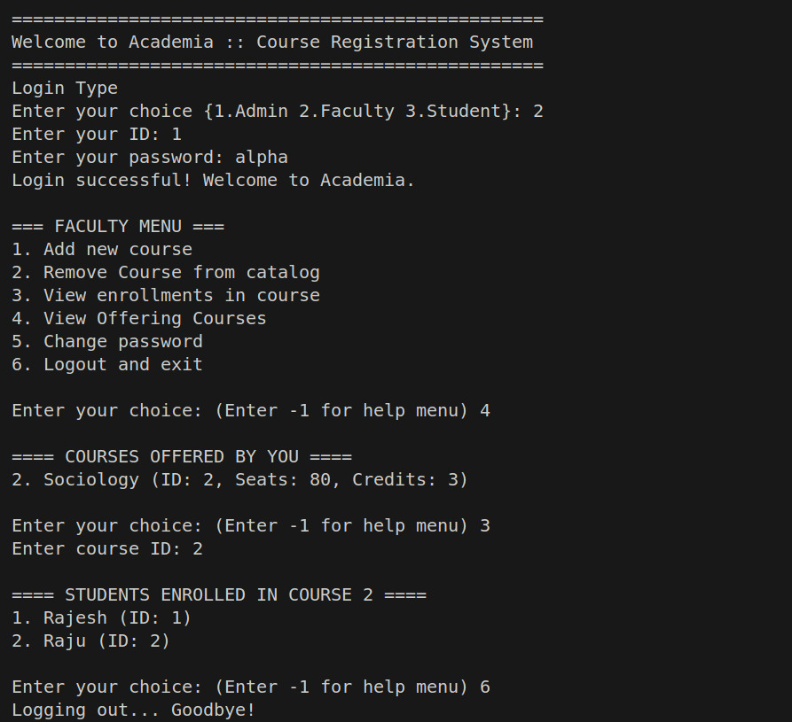

  

### Student Features
- Enroll in available courses
- Unenroll from already enrolled courses
- View current course enrollments
- Change password

  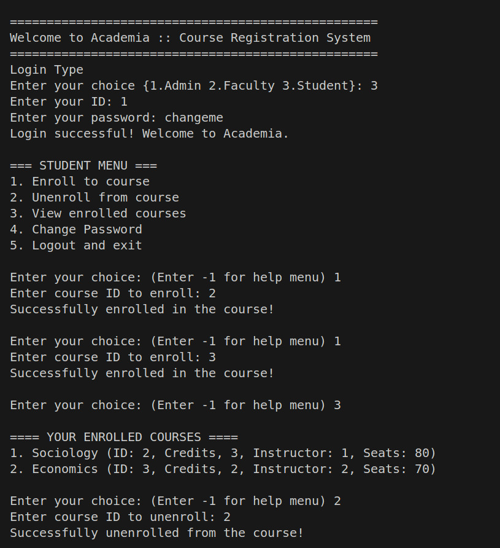

  

## System Architecture
The system follows a client-server architecture where:
1. The server maintains the database and serves multiple clients concurrently
2. Clients connect to the server and access their specific academic details based on their role
3. Critical data sections are protected by appropriate locking mechanisms to prevent race conditions
4. Multiple threads handle concurrent client connections without blocking

## Conclusion
The Academia Portal demonstrates practical application of various system programming concepts including socket programming, file management, process synchronization, and concurrent programming. This project provides a scalable and robust solution for educational institutions to manage their course registration processes efficiently.
